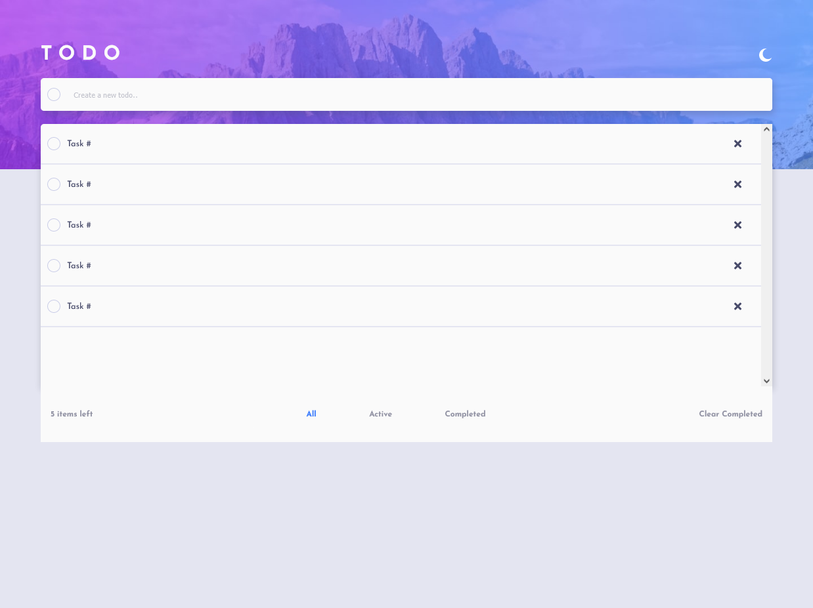

# Frontend Mentor - Todo app solution

This is a solution to the [Todo app challenge on Frontend Mentor](https://www.frontendmentor.io/challenges/todo-app-Su1_KokOW). Frontend Mentor challenges help you improve your coding skills by building realistic projects.

## Table of contents

- [Overview](#overview)
  - [The challenge](#the-challenge)
  - [Screenshot](#screenshot)
  - [Links](#links)
- [My process](#my-process)
  - [Built with](#built-with)
  - [What I learned](#what-i-learned)
  - [Continued development](#continued-development)
  - [Useful resources](#useful-resources)
- [Author](#author)
- [Acknowledgments](#acknowledgments)

**Note: Delete this note and update the table of contents based on what sections you keep.**

## Overview

### The challenge

Users should be able to:

- View the optimal layout for the app depending on their device's screen size
- See hover states for all interactive elements on the page
- Add new todos to the list
- Mark todos as complete
- Delete todos from the list
- Filter by all/active/complete todos
- Clear all completed todos
- Toggle light and dark mode

### Screenshot




-

### Links

- Solution URL: [Front-end mentor solution](https://www.frontendmentor.io/challenges/todo-app-Su1_KokOW/hub/mobile-first-design-scss-vainillajs-html-css-Bdg8tddPE)
- Live Site URL: [https://ehidalgo506-dev.github.io/TodoApp/](https://ehidalgo506-dev.github.io/TodoApp/)

## My process

I divided every section and focused on completed that section only (HTML/CSS) and be fully responsive with Dark Mode included.

Once I had the website ready I did a general flowchart on how the app should work and to divide the functionality in small steps. The flowchart also helped me decide which methodology to use and in this case I went from OOP since is the one I'm currently learning. After that I start coding! <3

### Built with

- Semantic HTML5 markup
- CSS custom properties
- SCSS
- Flexbox
- Mobile-first workflow
- Vainilla JS

### What I learned

The main challenge that I faced was on how to link the task Object with the current element, for example, if the user selects the task HTML element then how will I link that element selected with the Object on which it was created.

I had to investigate a lot and found that the best way was to create an ID on the HTML element and on the Object. Both will have the same ID and then I will just need to find the Object based on the ID of the HTML element (data-id attribute).

Also, I faced some other challenged, like I'm used to creating elements dynamically but refreshing the whole container but If I implemented this then all the "completed" tasks were reset and all the tasks were active. So I had to speak with other developers and investigate online and found that the best way was to work with the createElement() and prepend() to add new elements to the container without resetting it.

I didn't know how to implement Dark Mode and with this project now I have an overall idea.

I've heard about LocalStorage before but I have never use it so for this project for me it seems it was a good idea and investigated and implement it.

=========================
Proud of this JS function
=========================

```js
const proudOfThisFunc = () => {
  #markTask(e) {
    const taskEl = e.target.closest(".task");
    const check = taskEl.querySelector(".checkbox--group-input");
    const nTask = this.#tasks.find((el) => el.id == taskEl.dataset.id);
    if (!taskEl) return;

    taskEl.classList.toggle("task--selected");
    taskEl.classList.toggle("task--done");

    check.checked == false ? (check.checked = true) : (check.checked = false);
    nTask.isActive == true ? (nTask.isActive = false) : (nTask.isActive = true);

    this.#filterTasks(true);
  }
};
```

### Continued development

This project helped me learn and practice a lot of thigs but it also opened my eyes that I need to practice. Some I will keep doing personal projects till the end of times.

### Useful resources

- [Codementor](https://www.youtube.com/watch?v=P69ItyngM-0&t=188s&ab_channel=Codementor) - I was struggling with deleted all the objects that the property isActive was false and looking at this youtuber helped me a lot.
- [MDN](https://developer.mozilla.org/en-US/) - The bible of web developers.

## Author

- Website - [Todo - Esteban Hidalgo](https://www.your-site.com)
- Frontend Mentor - [@ehidalgo506-dev](https://www.frontendmentor.io/profile/@ehidalgo506-dev)
- Github - [@ehidalgo506-dev](https://github.com/ehidalgo506-dev)

## Acknowledgments

I want to say thanks to [@crutchcorn](https://www.twitch.tv/crutchcorn) who I met on twitch and he has always giving me tips and guidance.

And Robert Mennel from crutchcorn's Discord server who always answers any of my JS questions.

Thanks Guys!
